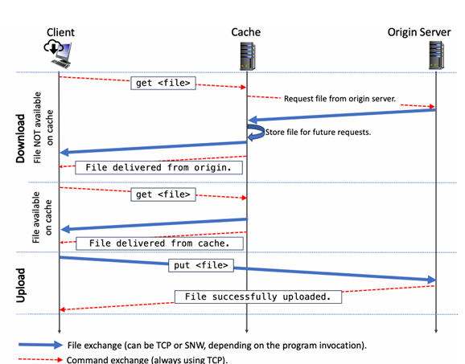

# **File Upload and Download with Cache Implementation**

This project demonstrates a **file upload and download system** leveraging a client-server architecture with a cache in the middle. The system ensures efficient file transfers by reducing the need for repeated server requests when files are available locally in the cache.

## **Project Overview**

The main objective of this project is to create a **cache-enabled file transfer system** that handles file uploads and downloads between a client, cache, and server. The system checks whether the requested file is already cached and if not, retrieves it from the server, caching it for future requests. The implementation includes support for **two transport protocols**: 
- **TCP (Transmission Control Protocol)**
- **Stop-and-Wait (SNW) protocol**

## **Key Features**

1. **Client-Cache-Server Architecture**: The client interacts with both the cache and the server to upload and download files.
2. **File Uploads**: Files uploaded by the client are directly stored on the server, without utilizing the cache.
3. **File Downloads**: Files requested by the client are first searched in the cache. If the file is found, it is delivered from the cache, reducing server load. If the file is not found, it is fetched from the server and cached for future use.
4. **Transport Layer Abstraction**: The system supports both reliable TCP and stop-and-wait over UDP, ensuring flexibility in handling file transfers under different network conditions.
5. **Timeout Mechanisms**: The stop-and-wait protocol includes a robust timeout mechanism to handle lost packets and ensure reliable data transmission.

## **Supported Commands**

- `put <file>`: Uploads a file from the client to the server.
- `get <file>`: Downloads a file from the cache or server, depending on availability.
- `quit`: Exits the program.

## **Implementation Details**

- **Caching Logic**: Before retrieving files from the server, the cache is checked. If the file exists locally in the cache, it is delivered immediately; otherwise, the server is queried, and the file is cached for subsequent requests.
- **Transport Layer**: 
  - **TCP**: Ensures reliable communication using built-in mechanisms.
  - **SNW Protocol (Stop-and-Wait)**: Implemented with custom reliability using ACKs (acknowledgments) and timeouts to handle data transmission over UDP.

## **Architecture Diagram**

Refer to the diagram below for a visual representation of the interactions between the client, cache, and server:



## **Packet Capture and Performance Evaluation**

The project includes performance testing using **Wireshark** to capture the packet exchanges and evaluate overall delay and throughput for both TCP and SNW. The following files are used for testing:
- `file1.txt` (16KB)
- `file2.txt` (32KB)
- `file3.txt` (48KB)
- `file4.txt` (62KB)

The results are displayed in tabular form and highlight the differences between TCP and SNW in terms of delay and throughput.

| **File** | **Size**  | **TCP Delay(sec)** | **SNW Delay(sec)** | **TCP Throughput(bps)** | **SNW Throughput(bps)** |
|----------|-----------|---------------|---------------|--------------------|--------------------|
| file1.txt | 16KB     | 0.007334      | 0.038724      | 16.228M            | 3.073M       |
| file2.txt | 32KB     | 0.0122        | 0.074541      | 19.513M            | 3.193M       |
| file3.txt | 48KB     | 0.0144        | 0.111636      | 24.801M            | 3.199M       |
| file4.txt | 62KB     | 0.0137        | 0.1763        | 34.774M       | 2.700M       |

## **Technologies Used**

- **Programming Languages**: Python
- **Transport Protocols**: TCP, UDP (Stop-and-Wait)
- **Wireshark**: Used for packet analysis and performance evaluation.
- **Caching**: Custom cache implementation for file storage.

---

## **How to Run the Project**

1. Clone the repository:
   ```bash
   git clone <repository-url>

2. Navigate to the project directory:
   ```bash
   cd <project-directory>

3. Run the server:
   ```bash
   git clone <repository-url>
4. Run the cache:
   ```bash
   python cache.py <port> <server_ip> <server_port> <protocol>

5. Run the client:
   ```bash
    python client.py <server_ip> <server_port> <cache_ip> <cache_port> <protocol>

6. Upload a file to the server:
   ```bash
   put <file_path>

7. Download a file from the cache or server:
   ```bash
   get <file_path>

8. Quit the program:
    ```bash
   quit


## **Command Line Arguments**

- `server.py <port> <protocol>`: 
   - Starts the server on the specified port.
   - The `<protocol>` can be either `tcp` or `snw` (stop-and-wait).

- `cache.py <port> <server_ip> <server_port> <protocol>`: 
   - Starts the cache on the specified `<port>`.
   - Connects to the server using the provided `<server_ip>` and `<server_port>`.
   - The `<protocol>` can be either `tcp` or `snw`.

- `client.py <server_ip> <server_port> <cache_ip> <cache_port> <protocol>`: 
   - Starts the client.
   - Connects to the server using `<server_ip>` and `<server_port>`.
   - Connects to the cache using `<cache_ip>` and `<cache_port>`.
   - The `<protocol>` can be either `tcp` or `snw`.

